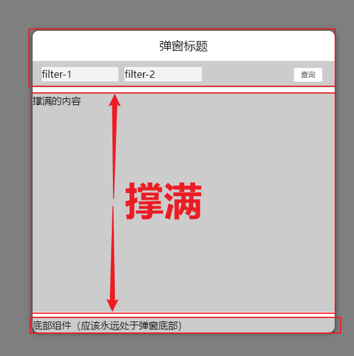

# 弹窗布局

[点击跳转题目页面](/#/dialogStyle)

## 修改组件：`src/views/dialogStyle/components/MyDialog.vue` 中的内容，达到以下要求：

##### 1. 在不影响标题，顶部组件与底部组件高度的情况下，中间内容组件撑满容器其余高度
   

##### 2. 顶部内容需要水平排列，并保持高度居中对齐
   

##### 3. 当`props.filterList`(src/views/dialogStyle/index.vue)未指定宽度时，当前`filter-item`默认宽度为剩余宽度的三分之一
   ```js
   const filterList = [
     {
       text: 'filter-1',
     },
     {
       text: 'filter-2',
     },
     {
       text: 'filter-3',
     },
   ]
   ```
   
   ```javascript
   const filterList = [
     {
       text: 'filter-1',
     },
     {
       text: 'filter-2',
     },
   ]
   ```
   
###### 传递宽度时，使用指定的宽度
   ```js
   const filterList = [
     {
       text: 'filter-1',
       width: 200
     },
     {
       text: 'filter-2',
     },
   ]
   ```
   

##### 4. 展开收起的按钮默认隐藏，当`filter-item`超出一行空间，则换行展示，并且显示展开收起的按钮


##### 5. `filter-item`默认隐藏换行内容，并且展开收起按钮默认为收起状态，提示文字为：`展开`
   

##### 6. 点击展开之后，展示所有`filter-item`，并且按钮文字切换为：`收起`
   
