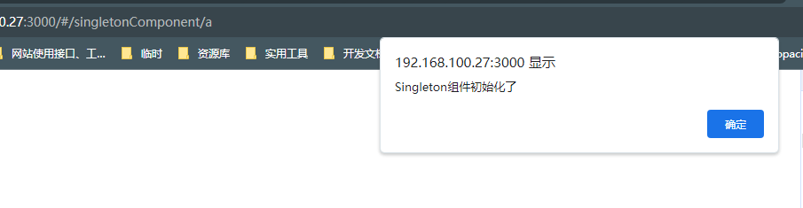

# 弹窗布局

## 组件说明

[点击跳转题目页面](/#/singletonComponent/a)

如果在多个页面或组件中频繁使用初始化占用大量资源的组件，并且这些地方使用组件的目的几乎相同，那么每次切换页面都会导致重新初始化，从而占用过多的浏览器资源。为此，需要进行优化。

而这个题目，就是如何在不同的组件或者页面中引用相同的组件，并且切换页面和组件时，该组件只能初始化一次

## 修改组件：`src/views/singletonComponent/components/Singleton.vue` 中的内容，达到以下要求：

##### 1. 第一次进入a页面时，Singleton组件将会弹出初始化弹窗。


##### 2. 跳转到b页面或后续继续跳转到a页面时，不会再出现初始化提示弹窗

##### 3. 尽量保持当前a/b页面代码不变

##### 4. 如果做不到第3条，修改a页面和b页面的同时必须保持对`Singleton`组件的引用和渲染

##### 5. 保持Singleton组件中初始化的代码不变，即以下代码：
```javascript
onMounted(() => {
  alert('Singleton组件初始化了')
})
```